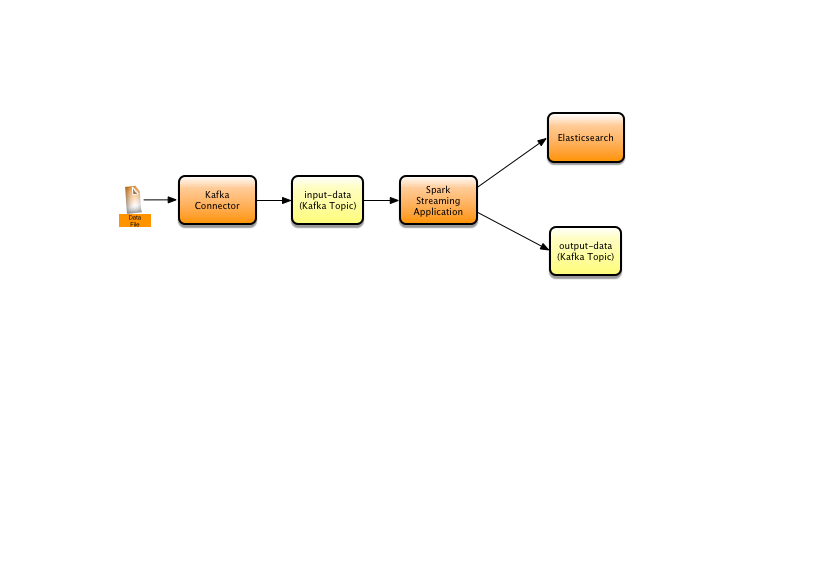
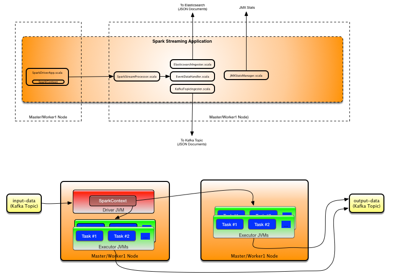

# Overview
This project demonstrates the use of [Spark Stream Processing](https://spark.apache.org/docs/latest/streaming-programming-guide.html#discretized-streams-dstreams) with [Spark Kafka integration](https://spark.apache.org/docs/latest/streaming-kafka-integration.html). Additionally, it also demonstrates data ingestion to Elastisearch, and uses a Kafka Connector to read sample data from a CSV file and stream via a Kafka Topic.

  

The sample data is from the [Bureau of Tranportation Statistics](https://www.transtats.bts.gov/databases.asp?Mode_ID=1&Mode_Desc=Aviation&Subject_ID2=0) and contains Airline on-time performance statistical data. The data schema is documented [here](http://stat-computing.org/dataexpo/2009/the-data.html)


----


## How it Works
The Spark stream processing application does the following
* Consumes a data stream from a Kafka `input-data` Topic, parses data elements from a comma delimited format to JSON documents
* Ingests JSON documents to Elastisearch
* Ingests JSON documents to a Kafka `output-data` Topic


----


# Pre-requisits
## Kafka
Instructions here assumes the use of Confluent Kafka. See [instructions here](https://docs.confluent.io/current/installation/installing_cp.html) on how to download and install Kafka. The main reason to use Confluent Kafka is to be able to use the [Kafa File Stream Connector](https://docs.confluent.io/current/connect/connect-filestream/filestream_connector.html#) bundled with the Confluent distro. This Connector reads a sample CSV data file and places its content on the `input-data` Topic.

### Start Kafka
* After downloading and installing Kafka, start the instance as below:
  ```
  [KAFKA_INSTALL_DIR]/bin/zookeeper-server-start -daemon ../etc/kafka/zookeeper.properties && ./kafka-server-start  -daemon ../etc/kafka/server.properties
  ```

* Check the `[KAFKA_INSTALL_DIR]/logs/zookeeper.out` and `[KAFKA_INSTALL_DIR]/logs/server.log` to make sure Zookeeper and Kafka startup was successful.

* Zookeeper and Kafka can be terminated as below
  ```
  [KAFKA_INSTALL_DIR]/bin/zookeeper-server-stop && ./kafka-server-stop
  ```

### Create Topics
Create the two topics as below:

    [KAFKA_INSTALL_DIR]/kafka-topics --create --zookeeper localhost:2181 --replication-factor 1 --partitions 5 --topic input-data
    [KAFKA_INSTALL_DIR]/kafka-topics --create --zookeeper localhost:2181 --replication-factor 1 --partitions 5 --topic output-data

### Test the Kafka installation
Start the Console Consumer:

    [KAFKA_INSTALL_DIR]/kafka-console-consumer.sh --bootstrap-server localhost:9092  --topic input-data --from-beginning

Start the Console Producer:

    [KAFKA_INSTALL_DIR]/kafka-console-producer  --broker-list localhost:9092 --topic input-data

Type some text on the Producer prompt, you should see it appear in the Consumer prompt.

## Kafka Connector Configuration
Edit the `src/main/resources/connect-file-source.properties`, change the line below to reflect the path to the sample data file - change the `[PATH_TO_PROJ_DIR]` part.
```
file=[PATH_TO_PROJ_DIR]/spark-stream-processor/data/sample.csv
```

## Elastisearch & Kibana
### Elastisearch Instance
* Follow the instructions [here](https://www.elastic.co/downloads/elasticsearch) on how to download and install.

* Check the `[ELASTICSEARCH_DIR/logs/[CLUSTER_NAME].log]` file to verify that Elastisearch node start up was successful.

### Kibana Instance
How to download and install Kabana is [here](https://www.elastic.co/guide/en/kibana/current/install.html).

* Verify Kibana access by pointing your browser to `localhost:5601`

* Goto the `Dev Tools` tab on Kibana and execute the query below. If the query executes successfully, then you have a running Elastisearch and Kibana instances.
  ```
  GET _search
  {
    "query": {
    "match_all": {}
    }
  }
  ```

## Elastisearch Data Mapping
* Elastisearch data mapping is explained [here](https://www.elastic.co/guide/en/elasticsearch/reference/current/mapping.html).

* Goto the `Dev Tools` table on Kibana and execute the mapping query below by replacing the `[QUERY_JSON_STRING]` section with the contents of `src/main/resources/es-mapping.json` file.

  ```
  PUT _template/data-template

    [QUERY_JSON_STRING]

  ```


## Elastisearch Indexes
Indexes are created automatically during the ingestion process. The [Elastisearch Bulk Processor](https://www.elastic.co/guide/en/elasticsearch/client/java-api/current/java-docs-bulk-processor.html) is used internally to ingest data in batches. The index names are derived from the timestamp of input data records. e.g: `data-2017-11-17`. They are prefixed with `data-`.


----


# Running the Spark Streaming Application
## Compile and Run with Gradle
Use the command below to compile and run in-line.
```
 [PATH_TO_PROJ_DIR]/gradlew clean run
```

## Deploying and Running on a Spark Cluster
* Build an uber jar using the  `sparkJar` Gradle task
  ```
  [PATH_TO_PROJ_DIR]/gradlew clean sparkJar
  ```
* Copy the built jar file `[PATH_TO_PROJ_DIR]/build/libs/spark-stream-processor-spark-1.0.0-SNAPSHOT` to a mount point/location accessible by all Spark cluster nodes

* Submit the Spark streaming job using `spark-submit`. E.g:
  ```
  spark-submit --class com.its.demo.sparkstreaming.SparkDriverApp --master spark://master:6066 --deploy-mode cluster  --driver-java-options "-Djava.io.tmpdir=/stream-data/java-tmp" --conf "spark.local.dir=/stream-data/spark-tmp" --num-executors 1 --executor-cores 1 --executor-memory 1G --total-executor-cores=2 /[MOUNT_POINT]/spark-stream-processor-spark-1.0.0-SNAPSHOT.jar
  ```
  Change command line arguments as necessary. The `[MOUNT_POINT]` can be a NFS or HDFS mount.

The diagram below depicts the Spark cluster deployment.




---


# End-to-end Testing
1. Make sure that the Zookeeper, Kafka, and Elasticsearch instances (JVMs) are running

2. Start the Spark streaming application using Gradle or by deploying on a Spark cluster. Example below uses Gradle.
    ```
    [PATH_TO_PROJ_DIR]/gradlew clean run
    Java HotSpot(TM) 64-Bit Server VM warning: ignoring option MaxPermSize=128M; support was removed in 8.0
    :clean
    :compileJava UP-TO-DATE
    :compileScala
    :processResources
    :classes
    :run
    SLF4J: Class path contains multiple SLF4J bindings.
    SLF4J: Found binding in [jar:file:/Users/coorayr/.gradle/caches/modules-2/files-2.1/ch.qos.logback/logback-classic/1.0.13/6b56ec752b42ccfa1415c0361fb54b1ed7ca3db6/logback-classic-1.0.13.jar!/org/slf4j/impl/StaticLoggerBinder.class]
    SLF4J: Found binding in [jar:file:/Users/coorayr/.gradle/caches/modules-2/files-2.1/org.slf4j/slf4j-log4j12/1.7.21/7238b064d1aba20da2ac03217d700d91e02460fa/slf4j-log4j12-1.7.21.jar!/org/slf4j/impl/StaticLoggerBinder.class]
    SLF4J: See http://www.slf4j.org/codes.html#multiple_bindings for an explanation.
    SLF4J: Actual binding is of type [ch.qos.logback.classic.util.ContextSelectorStaticBinder]
    ###-> 20:04:02.454 main - INFO - c.i.d.sparkstreaming.SparkDriverApp$: ===> Created SparkContext ...
    ###-> 20:04:03.760 main - INFO - c.i.d.s.SparkStreamProcessor: ===> Write to output Topic: true, write to ES: true
    ###-> 20:04:03.908 main - INFO - c.i.d.s.SparkStreamProcessor: ===> Created the DStream ...
    ###-> 20:04:03.909 main - INFO - c.i.d.s.SparkStreamProcessor: ===> Connected to Kafka Broker: [localhost:9092], subscribed to Topics: List(input-data) ...
    ###-> 20:04:04.445 main - INFO - c.i.d.s.SparkStreamProcessor: ===> Started stream processing, waiting for new events from Kafka ...
    > Building 83% > :run
    ```

    The application is now ready to receive streaming data from the `input-data` Kafka Topic

3. Start the Console Consumer pointing to the `output-data` Topic
    ```
    [KAFKA_INSTALL_DIR]/kafka-console-consumer.sh --bootstrap-server localhost:9092  --topic output-data --from-beginning
    ```

    The Console Consumer should output the transformed JSON data.

4. Start the Kafka Connector
    ```
    [KAFKA_INSTALL_DIR]/connect-standalone [PATH_TO_PROJ_DIR]/spark-stream-processor/src/main/resources/connect-standalone.properties [PATH_TO_PROJ_DIR]/spark-stream-processor/src/main/resources/connect-file-source.properties
    ```

    * The Kafka Connector will read the `sample.csv` and place its content in the `input-data` Topic
    * You can hit Ctrl + c to terminate the Connector process
    * The Connector will only process the file once; it maintains the file offset and will only process inserts to the file. Thus, if you can re-process the same file by:
      * First stop the Connector - Ctrl + code
      * Delete the `/tmp/connect.offsets`. The location for this file is defined in the `[KAFKA_INSTALL_DIR]/etc/kafka/connect-standalone.properties` file
      * Re-start the Connector


----


# Using Kibana to Query Data

Below queries can be from the `Dev Tools` tab in Kibana.

* Search all flights that incurred a departure delay >= 30 mins and =< 50 mins
  ```
  POST /data-*/_search
  {
    "query": {
      "constant_score": {
        "filter": {
          "bool": {
            "must": [
              {
                "range": {
                  "departureDelay": {
                    "gte": "30",
                    "lte": "50"
                  }
                }
              }
            ]
          }
        }
      }
    }
  }
  ```

* Search for data processing errors
  ```
  POST /data-*/_search
  {
    "query": {
      "constant_score": {
        "filter": {
          "bool": {
            "must": [
              {
                "term": {
                  "eventType": "ERROR_DATA_REC"
                }
              }
            ]
          }
        }
      }
    }
  }
  ```

* Search for flights with the cancellation code `A` = carrier; flights that were cancelled due to carrier
  ```
  POST /data-*/_search
  {
    "query": {
      "constant_score": {
        "filter": {
          "bool": {
            "must": [
              {
                "term": {
                  "cancellationCode": "A"
                }
              }
            ]
          }
        }
      }
    },
    "aggs": {
      "byCarrier": {
        "terms": {
          "field": "carrierCode"
        }
      }
    }
  }
  ```

* Other useful queries
  * Get index info
    ```
    GET /data-*/_stats/store
    ```

  * Cluster info
    ```
    GET /_cluster/state
    ```

  * More on indexes
    ```
    GET /_cat/indices?v
    ```

  * Delete all indexes - use with caution
    ```
    DELETE data-*
    ```
